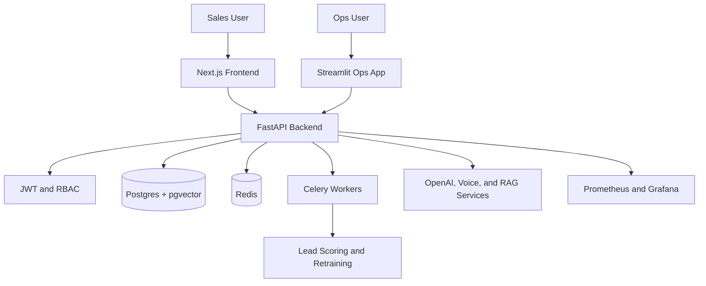

# LeadForge AI

     

Forge conversations into conversions with autonomous sales intelligence.

LeadForge AI is a production-style enterprise sales intelligence platform for education sales teams, combining CRM workflows, authentication, RBAC, customer memory, lead intelligence, follow-up generation, RAG knowledge base, manager copilots, background jobs, observability, and deployment assets.

## Resume Value

The strongest full-stack SaaS project in the workspace, showing backend architecture, frontend integration, Docker orchestration, MLOps-style retraining, auth, workers, and observability.

## Features

- JWT authentication with refresh and logout flows.
- Role-based workflows with V3 ADMIN, MANAGER, and AGENT semantics mapped to existing roles for backward compatibility.
- Lead CRUD, import preview, bulk upload, timeline, and scoring.
- Customer Memory APIs for objections, sentiment, budget, preferred contact time, summaries, and next actions.
- AI lead intelligence for score explanations, sentiment, intent, objections, and next best action.
- AI follow-up generation for WhatsApp messages, email, and call scripts.
- LeadForge Voice Agent for deterministic/OpenAI-assisted call scripts, objection intelligence, safe simulations, and consent-gated Twilio calls.
- RAG knowledge base upload, vector search, and ask-with-citations APIs.
- Manager Copilot analytics for best agents, hot leads, follow-ups due, objection analytics, and conversion analytics.
- Polished operations dashboard with at-a-glance Hot Leads, Conversion Rate, Follow-ups Due, AI Insights, Customer Memory, and Manager Copilot views.
- AI manager chat, RAG, recommendations, and lead intelligence.
- Celery workers for reports, ML jobs, notifications, and reindexing.
- Docker Compose stack with Postgres, Redis, backend, frontend, Nginx, Prometheus, and Grafana, plus production Compose.

## Business Impact

- Models a real sales operations platform for education teams managing leads, calls, and manager oversight.
- Connects AI capabilities to measurable workflows: scoring, recommendations, reporting, and call intelligence.
- Shows production awareness with auth, RBAC, background workers, observability, and container orchestration.

## Architecture



## Project Structure

- backend/: FastAPI app, API routes, services, database, workers, and security.
- frontend/: Next.js dashboard and authenticated UI flows.
- streamlit_app/: operations dashboard for model/admin workflows.
- ai_models/: lead scoring, retraining, registry, and ML artifacts.
- deployment/: Render and Railway deployment descriptors.
- observability/, nginx/, docker-compose.yml: local production-style stack.
- tests/: backend, auth, AI, health, and retraining tests.

## Tech Stack

- Python 3.11
- FastAPI
- SQLAlchemy
- Postgres / pgvector
- Redis
- Celery
- Next.js
- Streamlit
- Docker Compose
- Pytest

## Screenshots

Add screenshots to `docs/screenshots/` and reference them here:

| View | Screenshot |
| --- | --- |
| dashboard | `docs/screenshots/dashboard.png` |
| lead details | `docs/screenshots/lead-details.png` |
| manager ai | `docs/screenshots/manager-ai.png` |
| ops app | `docs/screenshots/ops-app.png` |
| observability | `docs/screenshots/observability.png` |

## Local Setup

```powershell
python -m venv .venv
.\.venv\Scripts\Activate.ps1
pip install -r backend\requirements.txt
cd frontend
npm install
cd ..
```

Copy `.env.example` to `.env` when the project requires API keys or deployment secrets. Never commit real secrets.

## Local Non-Docker Demo

Demo credentials:

- Email: `admin@demo.com`
- Password: `Password123!`

Create or repair the local demo administrator:

```powershell
$env:DATABASE_URL="sqlite:///./sales_ai.db"
$env:SEED_DEMO_DATA="true"
python scripts\seed_demo.py
```

Run the backend from the repository root:

```powershell
$env:DATABASE_URL="sqlite:///./sales_ai.db"
$env:REDIS_URL="redis://localhost:6379/0"
$env:SEED_DEMO_DATA="true"
$env:REQUIRE_REDIS_FOR_READINESS="false"
uvicorn app.main:app --app-dir backend --host 0.0.0.0 --port 8000
```

Run the frontend:

```powershell
cd frontend
$env:NEXT_PUBLIC_API_URL="http://localhost:8000/api/v1"
npm run dev
```

Open http://localhost:3000/login and sign in with the demo credentials. If port 3000 is already in use, Next.js will print the alternate local URL.

## Docker Run

```powershell
docker compose up --build
```

If Docker image pulls fail with Docker Hub or CloudFront `EOF` errors, treat that as a network/registry problem rather than an application failure. Retry on a different network or pre-pull the base images listed in `docs/final_deployment_report.md`.

## Validation

```powershell
pip install -r backend\requirements.txt
pytest tests
cd frontend
npm install
npm run build
cd ..
docker compose config
$env:POSTGRES_PASSWORD="validation-only"
docker compose -f docker-compose.prod.yml config
```

## API Documentation

- Swagger UI: http://localhost:8000/docs
- GET /health, /live, /ready, /metrics
- /api/v1/auth/*
- /api/v1/leads/*
- /api/v1/customer-memory/*
- /api/v1/lead-intelligence/*
- /api/v1/followups/*
- /api/v1/knowledge-base/*
- /api/v1/manager-copilot/*
- /api/v1/calls/*
- /api/v1/analytics/*
- /api/v1/ai/*

### LeadForge Voice Agent

Open `http://localhost:3000/calls` and use the LeadForge Voice Agent panel to generate a script, simulate a conversation, review objection intelligence, and save the interaction without placing a phone call.

The Voice Agent supports English, Hindi, and Hinglish scripts, professional/friendly/persuasive tones, deterministic local simulation, call summaries, lead scoring, detected objections, and recommended next actions. Live calls remain consent-gated and require valid Twilio configuration.

New APIs:

- `POST /api/v1/ai/calling-agent/script`
- `POST /api/v1/ai/calling-agent/simulate`
- `POST /api/v1/ai/calling-agent/start-call`
- `POST /api/v1/ai/calling-agent/save-interaction`
- `GET /api/v1/ai/calling-agent/status`

Live calls require explicit consent, a valid phone number, and all Twilio variables:

```env
TWILIO_ACCOUNT_SID=
TWILIO_AUTH_TOKEN=
TWILIO_PHONE_NUMBER=
PUBLIC_BASE_URL=https://your-public-backend.example.com
```

Without Twilio credentials, script generation and simulation remain available and the live-call endpoint returns a safe configuration message without placing a call.
- /api/v1/operations/*
- /api/v1/ws/*

## Testing

Run the test suite when tests are present:

```powershell
pytest
```

For projects without tests, recommended next steps are smoke tests for imports, artifact loading, and one happy-path workflow.

## Deployment

- Use docker-compose.yml for local orchestration.
- Use docker-compose.prod.yml for production-style container deployment.
- Use deployment/render.yaml or deployment/railway.json for cloud setup.
- Replace all demo credentials and .env.example values with platform secrets.
- Use managed Postgres and Redis in production.
- Keep model artifacts in a registry or object storage if they grow.
- See docs/production_deployment.md and docs/security_checklist.md before production rollout.


